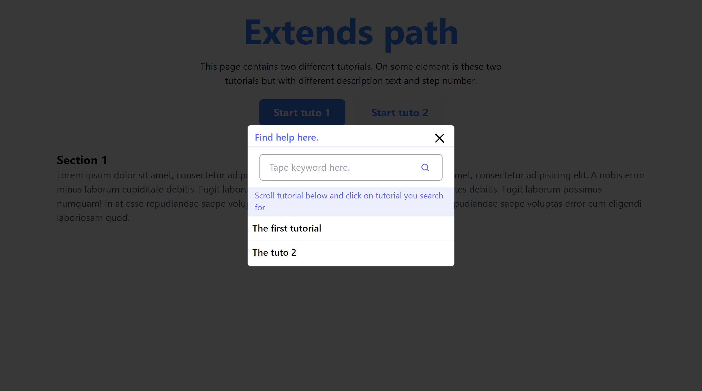

# HelpBox

The HelpBox allows your users to search for a tutorial and run it.
There a screeshot of the HelpBox 👇.



ExtendsHelpers allow TutoBox to establish the list of tutorials to display to your users as well as the keywords used to manage tutorial searches.

The extendsHelpers below produced the list of tutorials you saw on the screenshot.

```js
TutoBox.setExtendsHelpers([
  {
    title: "The first tutorial",
    tutoName: "tuto-1",
    keywords: ["keyword1","keyword2"],
  },
  {
    title: "The tuto 2",
    tutoName: "tuto-2",
    keywords: ["keyword3","keyword4"],
  },
]);
```
