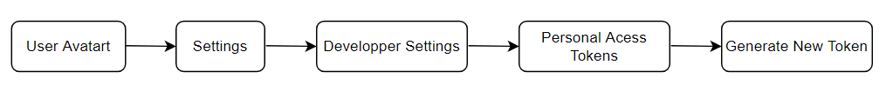
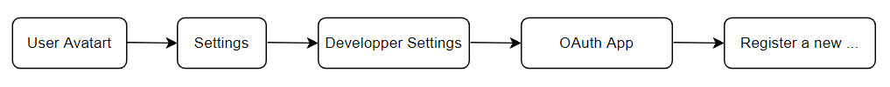
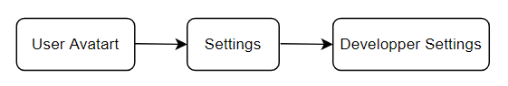
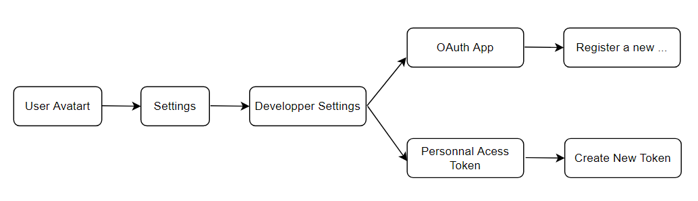

# Tutorial Extending

## Explanation

As you might guess tutorial extending allows you to make a tutorial inherit steps from other tutorials. This allows you to avoid unnecessary repetitions.

Let's see when it might be useful to you.
Suppose you own github web app and want to add two tutorials on the page `How to create a token ?` and `How to use Github OAuth Apps ?`.

Here is the user flow to create a token 👇.

Here is the user flow to use Github OAuth Apps 👇.

You can notice that these two user flows have an same start steps 👇.

Instead of adding two tutorials on these elements you can create a tutorial that encompasses these common steps and then create the other two tutorials and make them extend from the one created previously. That tutorial extending.

## Exemple
[See exemple here](../exemples/extends.md)
